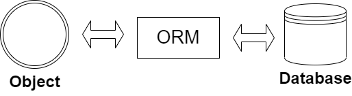

# :alien: **ORM 개론** 

**ORM이란**, Object Relational Mapping의 약자이고 객체 관계 매핑이라는 단어 뜻에서 알아차릴 수 있듯이 객체를 무언가와(를) 매핑하는 개념이다. 이 무언가는 관계형 데이터베이스이며, 데이터 베이스와 객체 지향 프로그래밍 언어 간의 호환되지 않는 데이터를 변환하는 프로그래밍 기법이다.[1]

<br>

## ORM

<br>

<p align="center"></p>

<br>

데이터베이스에서는 데이터 작성 및 쿼리에 SQL(Structured Query Language)을 사용한다. SQL은 모든 관계형데이터에스에서 사용되는 프로그래밍 언어이다. [2] 애플리케이션과 데이터베이스의 소통은 여러 가지 방식이 있다. 예를 들면, 애플리케이션 단(Layer)에서 소스 코드 내에 SQL을 작성하여 데이터베이스와 액세스 제어하거나 SP(Stored Procedure)를 이용해 데이터베이스 단에서 SQL을 작성하여 제어하는 방식이 있다. 

<br>

```
데이터 쿼리, 조작 등 액세스 제어를 하기 위해 SQL를 저장해두고 계속해서 재활용할 수 있는 것이 SP(Stored Procedure)이다. SP에는 변수도 넘길 수 있고 SQL를 매번 필요할 때마다 새로 작성하지 않아도 된다.
```

<br>

우선 애플리케이션 단에서 소스 코드 내에 SQL을 작성하여 제어하는 방식을 일명 '생 쿼리를 작성한다'라고 일컫는데 이에 따른 불편한 점(SQL의 문법 오류 찾기, 데이터베이스/테이블명 오타 찾기 등)이 많지만 외부적인 이유로 이점도 있다. 

<br>

애플리케이션에서 SP를 호출하여 데이터베이스 단에서 제어하는 방식은 관계형 데이터베이스 종류 중 하나인 MySQL(사용 버전 5.7.33)에서는 애플리케이션과 데이터베이스 간의 연결(connection)을 connection pool을 사용하지 않는다고 가정을 했을 때, 연결이 일어날 때마다 Stored Procedure를 컴파일하여 메모리에 캐싱된다. 매번 컴파일하여 메모리에 캐싱하는 과정이 생기니 데이터베이스 서버에 부하가 생길 수 있다.
> Connection pool을 사용하지 않는다고 가정한 이유는 필자가 사용한 버전 5.7.33에서는(이후 버전에서는 개선되었는지 모른다.) 간헐적으로 연결이 끊기는 이슈가 있고 재연결 시도 등 해결책 제공이 없어서이다.

<br> 


<br>

---
### **References**
[1] Wikimedia Foundation. (2022, July 13). *객체 관계 매핑*. Wikipedia. Retrieved January 9, 2023, from https://ko.wikipedia.org/wiki/%EA%B0%9D%EC%B2%B4_%EA%B4%80%EA%B3%84_%EB%A7%A4%ED%95%91 

[2] 데이터베이스란? 데이터베이스란 | Oracle 대한민국. (n.d.). Retrieved January 9, 2023, from https://www.oracle.com/kr/database/what-is-database/ 
