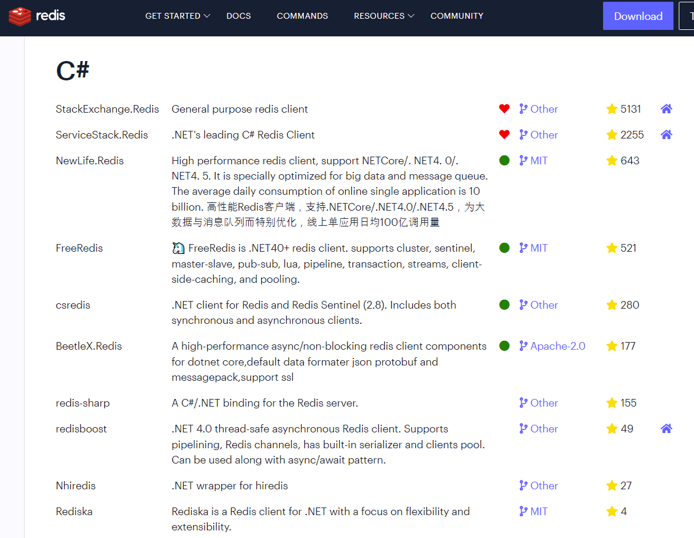
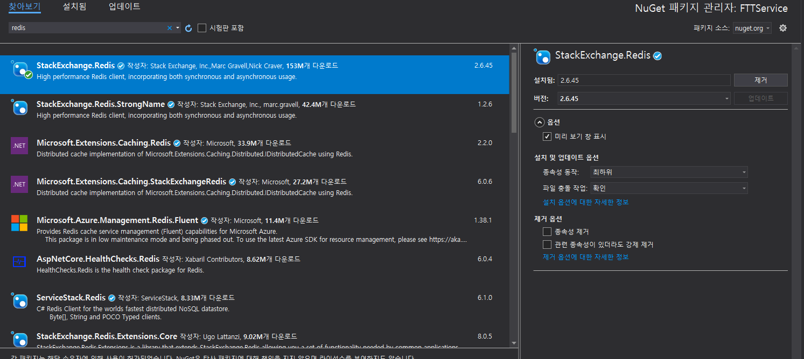

# :paperclip: **Redis .NET 연동 가이드** 

## Redis 사용을 위한 .NET 패키지 설치

<br>

<p align="center"></p>

<p align="center"></p>

C#을 지원하는 여러가지 패키지들이 있다. Redis에서 추천하는(하트💗 표시) 레포지토리 중 가장 많이 사용된다는 [StackExchange.Redis](https://stackexchange.github.io/StackExchange.Redis/) 패키지를 사용하기로 결정, NuGet 패키지 관리를 이용해 StackExchange.Redis 설치한다.

Redis DB 서버와의 연결을 위한 RedisService 라는 서비스 모듈 클래스 생성한다.

```c
RedisService.cs

using StackExchange.Redis;
using System;
using System.Collections.Generic;
using System.Linq;
using System.Web;

public class RedisService
{
    private static RedisService _instance;

    private ConnectionMultiplexer _redisConnection;
    private IDatabase _db;

    public RedisService()
    {

    }

    public static RedisService Instance
    {
        get
        {
            if (_instance != null)
            {
                return _instance;
            }
            else
            {
                _instance = new RedisService();

                return _instance;
            }
        }
    }

    public void Dispose()
    {
        if (_redisConnection != null)
        {
            _redisConnection.Dispose();
        }
    }

    /// <summary>
    /// Redis DB 연결
    /// </summary>
    /// <returns></returns>
    public bool Init()
    {
        try
        {
            ConfigurationOptions options = ConfigurationOptions.Parse(host + ":" + port); // host:port 지정
            options.AllowAdmin = true;
            options.ConnectTimeout = 10000;
            options.SyncTimeout = 10000;

            _redisConnection = ConnectionMultiplexer.Connect(options);

            if (_redisConnection.IsConnected)
            {
                _db = _redisConnection.GetDatabase();
                return true;
            }

            return false;
        }
        catch (Exception e)
        {
            return false;
        }
    }

    /// "GET" 명령어
    public string GetString(string key)
    {
        return _db.StringGet(key);
    }

    /// "SET" 명령어
    public bool SetString(string key, string val)
    {
        return _db.StringSet(key, val);
    }
}
```

<br>

---
### **References**
[1] *Redis clients*. Redis. (n.d.). Retrieved July 15, 2022, from https://redis.io/docs/clients/#csharp

[2] "StackExchange.Redis". StackExchange. (n.d.). Retrieved July 15, 2022, from https://stackexchange.github.io/StackExchange.Redis/