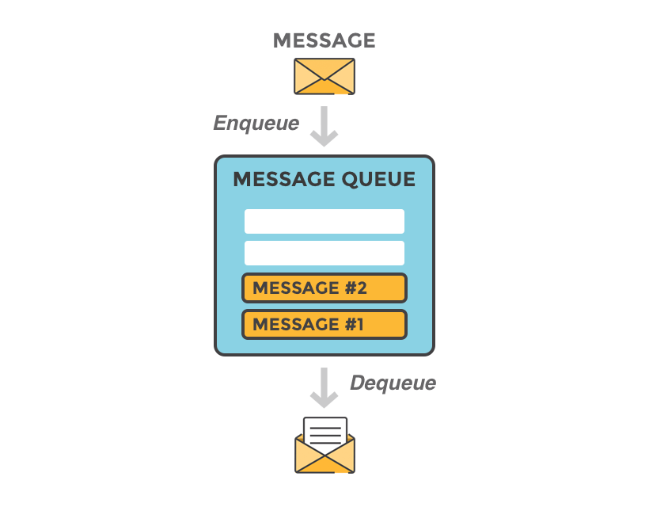
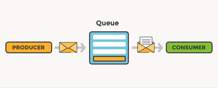

# **Message Queuing**

시스템 및 응용프로그램 간의 데이터 통신 방식이다.

> **Messaging**
> 
- 프로그램들이 데이터를 서로 직접적으로 호출해서 전송하는 것이 아니라 메시지의 형태로 전송하여 통신하는 것을 의미한다.

> **Queuing**
> 
- 메시지가 저장소의 queue에 저장되는 것을 의미하며, 프로그램이 서로 독립적으로, 서로 다른 속도와 시간에, 그리고 서로 논리적으로 연결되지 않고 실행될 수 있게 한다.
- 애플리케이션이 프로세스가 가능할 때까지 메시지를 가지고 있는 메커니즘이다.

 

### Message Queue란?

간단하게 말해서, 메시지를 보낼 수 있는 이름 있는 대상이다. 메시지가 queue에 쌓이는 데 해당 queue가 필요한 프로그램에 의해 쓰여질 때까지 쌓이게 된다.

Queue는 queue manager에 안에, 의해 관리된다. Queue는 컴퓨터 메모리 안에 휘발성을 가진 버퍼 공간에 있을 수 있고 디스크와 같은 영구 저장 장치에 있을 수 있다. 

 

> **메시징에서 쓰이는 일반적인 용어:**
> 

- Producing: `발신(sending)`과 다를 바 없다. 메시지들을 보내는 프로그램을 일컬어 **Producer**라고 한다.

- Queue: 메시지 브로커에 상주하고 있는 `우체통`과 같은 역할의 이름이다. 수많은 producer들이 하나의 queue에 메시지들을 보낼 수 있고, 수많은 consumer들이 하나의 queue에서 데이터를 받으려고 시도할 수 있다.

- Consuming: `수신(receiving)`과 비슷한 의미이다. **Consumer**라고 함은, 메시지들을 받으려고 주로 기다리는 프로그램을 말한다.

<aside>
💡 Producer, Consumer, Broker 모두 한 곳 호스트에 있지 않아도 된다. 대부분의 응용 프로그램에선 그렇지 않다. 한 응용 프로그램에서 Producer와 Consumer, 두 역할 모두가 될 수 있다.

</aside>

 

---

### **References**

*Introduction to message queuing*. (n.d.). Retrieved July 4, 2022, from [https://www.ibm.com/docs/en/ibm-mq/9.0?topic=overview-introduction-message-queuing](https://www.ibm.com/docs/en/ibm-mq/9.0?topic=overview-introduction-message-queuing)

*What is message queuing?* CloudAMQP. (n.d.). Retrieved July 4, 2022, from [https://www.cloudamqp.com/blog/what-is-message-queuing.html](https://www.cloudamqp.com/blog/what-is-message-queuing.html)