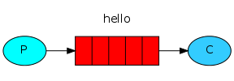
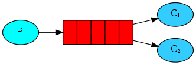
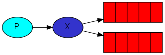
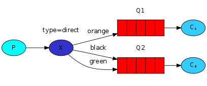

## RabbitMQ

AMQP(Advanced Message Queuing Protocol, 메시지 지향 미들웨어를 위한 개방형 표준 응용 계층 프로토콜)로 구현된 Erlang과 Java로 짜여진 메시지 브로커이다. 

<br>

### 미들웨어란 무엇인가?

```
미들웨어는 운영 체제에서 제공하지 않는 일반적인 서비스와 기능을 애플리케이션에 제공하는 소프트웨어입니다. 데이터 관리, 애플리케이션 서비스, 메시징, 인증 및 API 관리는 주로 미들웨어를 통해 처리됩니다.

미들웨어는 개발자들이 애플리케이션을 보다 효율적으로 구축할 수 있도록 지원하며 애플리케이션, 데이터 및 사용자 사이를 연결하는 요소처럼 작동합니다.

멀티 클라우드 및 컨테이너화된 환경을 갖춘 조직의 경우 미들웨어를 사용하면 스케일에 따라 비용 효율적으로 애플리케이션을 개발하고 실행할 수 있습니다.

- Red Hat에서 발췌
```

<br>

<p align="center"></p>

<p align="center">
<br><em><b>figure 1. "P" is our producer and "C" is our consumer.</b></em></p>

가운데 빨간색 박스가 queue인데 Consumer 대신에 RabbitMQ와 같은 broker(브로커)가 킵하고 있는 메시지 버퍼의 이름(여기선, “hello”)이다. 

<aside>
💡 간단하게,<br>
1. Producer가 `hello` 라는 queue에 메시지를 보낸다(발행한다).<br>
2. Consumer는 해당 queue에 있는 메시지를 받는다.
</aside>

<br>

### **Work(Task) Queues**

<p align="center"><br><em><b>figure 2</b></em></p>

Work(Task) Queues는 여러 workers를 둠으로써 시간이 걸리는 작업들을 분산시킬 수 있다. Task를 스케줄하여 나중에 완료시킬 수 있다. Task를 메시지로 캡슐화하여 queue로 보낸다. 

<aside>
💡 이 개념은 특히, 짧은 HTTP 요청 윈도우동안 복잡한 task를 처리할 수 없는 웹 애플리케이션에서 유용하다.
</aside>

<br><br>

> **라운드-로빈 배정(Round-robin dispatching)**
> 

Work(Task) Queue를 이용하는 장점들 중 하나는 일을 쉽게 병렬 처리할 수 있다는 점이다. RabbitMQ는 기본적으로(By default) 각 메시지를 다음 consumer에게 순서대로 보낸다. 평균적으로 각 consumer는 동일한 갯수의 메시지를 받는다. 이렇게 메시지들을 분산시키는 과정을 라운드-로빈(round-robin)이라 한다.

<br>

> **Message acknowledgment**
> 

Consumer가 메시지를 가져가는 처리 작업 도중에 죽거나 할 때, 메시지를 잃지 않기 위해 RabbitMQ는 message acknowledgments라는 것을 제공한다. Consumer는처리 완료된 특정 메시지를 지워도 된다는 ack를 RabbitMQ에게 다시 보내어 메시지를 잃는 상황을 방지한다. 

만약 consumer가 ack를 보내기 전에 처리 도중 연결이 끊긴다면, RabbitMQ는 메시지가 제대로 처리되지 않음을 인지하고 다시 queue에 쌓아 consumer에게 전달될 수 있도록 한다.

<br>

### **Publish/Subscribe**

수많은 consumer들에게 한 번에 메시지를 전달(브로드캐스트)하는 패턴이다.

> **Exchanges**
> 

<p align="center"><br><em><b>figure 3. “X” is an exchange.</b></p>

RabbitMQ의 메시징 모델에서는 producer가 절대로 어떠한 메시지든 queue에 직접적으로 보내지 않는다. 심지어 producer는 보낸 메시지가 어느 queue에 쌓이는 지도 모른다.

Producer는 대신 exchange에게만 메시지를 전달한다. Exchange의 한 쪽에서는 producer로부터 메시지를 받고 다른 한 쪽에서는 그 메세지를 queue에게 보낸다. 


- **Fanout Exchange**

메시지의 routing key(queue의 이름, figure 1 그림에선 `hello`)를 무시하고 exchange에 binding된 모든 queue에 메시지를 전달한다. (1:N 관계)

<br>

> **Bindings**

<p align="center"><br><em><b>figure 4</b></em></p>

Exchange가 queue로 메시지를 전달해야 하는데 exchange와 queue의 이 관계를 binding이라고 한다. 

<br>

- **Direct Exchange**

<p align="center"><br><em><b>figure 5</b></em></p>

메시지의 routing Key와 정확히 일치하는 binding key(i.g. orange, black, green)로 binding된 queue로 전달한다. (1:1 관계)

figure 5의 그림에선 `orange`라는 routing key로 메시지가 exchange에게 발행하였고 Q1이라는 queue에 전달된다. `black` 이나 `green` routing key를 갖고 있는 메시지는 Q2라는 queue에 전달된다. 그 외 나머지 메시지들은 버려진다.

<br>

> Multiple bindings

<p align="center"><br><em><b>figure 6</b></em></p>


같은 binding key로 여러 queue들을 binding하는 것도 가능하다. figure 6에서는 X와 Q1, Q2 관계의 binding key를 `black`으로 하면 direct exchange가 일치하는 모든 queue에게 메시지를 전달 할 것이기 때문에 마치 fanout exchange와 같이 행동하게 된다. 메시지의 routing key(`black`)이 일치하는 Q1, Q2에게 모두 전달된다.

<br>

> Subscribing

<p align="center"><br><em><b>figure 7</b></em></p>

다양한 binding key를 이용해 구독의 형태로 입맛에 따라 메시지들을 전달 받을 수 있다.

- **Topic Exchange**

- **Headers Exchnage**

<!-- 
```
1) Direct exchange - (Empty string) and amq.direct
 참고) AMQP 정의 : 바인딩 된 Queue 중에서 메시지의 라우팅 키와 매핑되어 있는 Queue로 메시지를 전달(1:1)
2) Fanout exchange - amq.fanout
 참고) AMQP 정의 : 메시지의 라우팅 키를 무시하고 Exchange에 바인딩 된 모든 Queue에 메시지를 전달(1:N)

3) Topic exchange -amq.topic
 참고) AMQP 정의 : Exchange에 바인딩 된 Queue 중에서 메시지의 라우팅 키가 패턴에 맞는 Queue에게 모두 메시지를 전달(Multicast)

4) Headers exchange - amq.match (and amq.headers in RabbitMQ)
 참고) AMQP 정의 : 라우팅 키 대신 메시지 헤더에 여러 속성들을 더해 속성들이 매칭되는 큐에 메시지를 전달
```
-->


### **Routing**

Receiving messages selectively

### **Topics**

Receiving messages based on a pattern

### **Remote procedure call (RPC)**

<br>

---

### **References**

*Rabbitmq tutorials*. RabbitMQ. (n.d.). Retrieved July 4, 2022, from [https://www.rabbitmq.com/getstarted.html](https://www.rabbitmq.com/getstarted.html) 

*Wikimedia Foundation.* (2022, February 14). *AMQP*. Wikipedia. Retrieved July 4, 2022, from [https://ko.wikipedia.org/wiki/AMQP](https://ko.wikipedia.org/wiki/AMQP)

미들웨어(middleware): 개념, 종류, 비교, 구성 요소, 툴, 장점. 미들웨어(Middleware): 개념, 종류, 비교, 구성 요소, 툴, 장점. (n.d.). Retrieved July 6, 2022, from https://www.redhat.com/ko/topics/middleware/what-is-middleware 